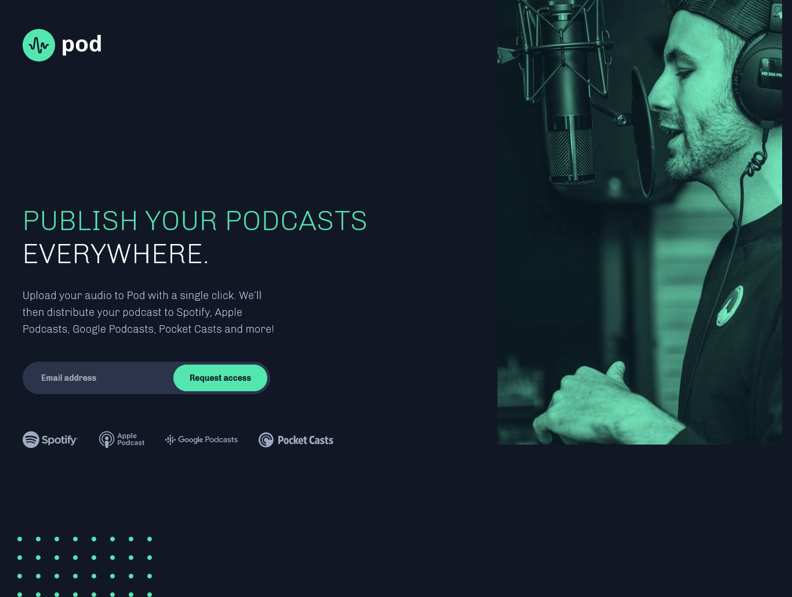

# Frontend Mentor - Pod request access landing page solution

This is a solution to the [Pod request access landing page challenge on Frontend Mentor](https://www.frontendmentor.io/challenges/pod-request-access-landing-page-eyTmdkLSG). Frontend Mentor challenges help you improve your coding skills by building realistic projects. 

## Table of contents

- [Overview](#overview)
  - [The challenge](#the-challenge)
  - [Screenshot](#screenshot)
  - [Links](#links)
- [My process](#my-process)
  - [Built with](#built-with)
  - [What I learned](#what-i-learned)
  - [Continued development](#continued-development)
  - [Useful resources](#useful-resources)
- [Author](#author)

**Note: Delete this note and update the table of contents based on what sections you keep.**

## Overview

### The challenge

Users should be able to:

- View the optimal layout depending on their device's screen size
- See hover states for interactive elements
- Receive an error message when the form is submitted if:
  - The `Email address` field is empty should show "Oops! Please add your email"
  - The email is not formatted correctly should show "Oops! Please check your email"

### Screenshot

### Links

- Solution URL: [Solution URL](https://www.frontendmentor.io/solutions/podrequestaccesslandingpage-with-scss-flexbox-and-js-vMVPmIxaX)
- Live Site URL: [Live site URL](https://mariafmedinae.github.io/Pod-request-access-landing-page/)

## My process

### Built with

- Semantic HTML5 markup
- CSS custom properties
- Flexbox
- Mobile-first workflow
- JavaScript
- [Sass](https://sass-lang.com/) - CSS Preprocessor 

### What I learned

I've learned about unitless values to line-height property and these are better options to avoid rare comportaments in the page.

Also, I've learned is a good practice to define width and height in the img tag to avoid unexpected changes in the layout.

### Continued development

Keep improving my knowledge about JavaScript, Sass and accessibility.

### Useful resources

- [Lighthouse Extension](https://chrome.google.com/webstore/detail/lighthouse/blipmdconlkpinefehnmjammfjpmpbjk?hl=en) - This helped me to improve the performance, accessibility, best practices and SEO of this project.

- [PerfectPixel Extension](https://chrome.google.com/webstore/detail/perfectpixel-by-welldonec/dkaagdgjmgdmbnecmcefdhjekcoceebi?hl=en) - This helped me to make the design the most similar possible to Figma file.

## Author

- Frontend Mentor - [@mariafmedinae](https://www.frontendmentor.io/profile/mariafmedinae)
